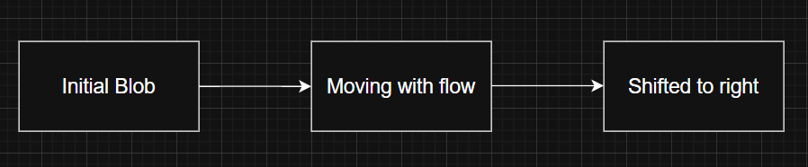
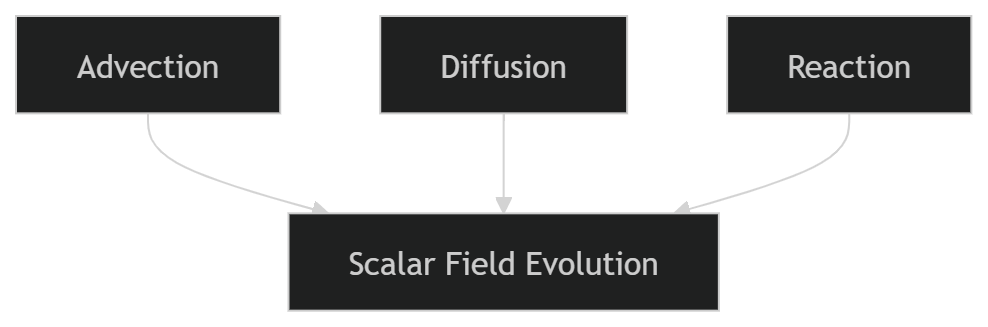

# Project 1: Reactive Scalar Transport Solver

## Objective

To develop a 2D finite-volume CFD solver for scalar transport including advection, diffusion, and reaction using Basilisk.

---

## Problem Description

A scalar concentration field (C) is initialized as a Gaussian blob and transported in a uniform velocity field.

The governing equation solved is:

`∂C/∂t + ∇·(uC) = D∇²C − kC`

The scalar undergoes:

- Advection (transport by flow)
- Diffusion (spreading due to gradients)
- Reaction (decay over time)

---

## Beginner-Friendly Explanation

Imagine you drop a drop of ink into flowing water.

Three things will happen:

1. The ink will **move with the water** → this is *Advection*
2. The ink will **spread out and mix** → this is *Diffusion*
3. The ink will **fade or disappear over time** → this is *Reaction*

This project simulates exactly this process using mathematics and numerical methods.

---

### What is a Scalar?

A scalar is simply a quantity that has a value at every point in space.

In this project:

- C represents concentration (like ink density)
- Each point in the domain has a value of C

---

### What is a Computational Domain?

We simulate the problem inside a square region:

- This is divided into many small cells (grid)
- Each cell stores a value of concentration

---

### What is a Gaussian Blob?

The initial condition is a "blob" of concentration.

Mathematically:

`C = exp(-100r²)`

This creates:

- High concentration at center
- Smooth decrease outward

👉 This gives a nice visible shape to track

---

### What Does the Solver Do?

At every time step:

1. Moves the scalar → Advection
2. Spreads it → Diffusion
3. Reduces it → Reaction

This process repeats until the final time.

---

### Why is This Important?

This type of simulation is used in:

- Pollution spreading in air/water
- Heat transfer problems
- Combustion modeling
- HVAC airflow analysis

---

### Simple Summary

- We start with a blob
- It moves, spreads, and fades
- The computer calculates this step by step

---

## Advection (Transport by Flow)

The scalar is transported by the velocity field without changing its shape significantly.
---

## Diffusion (Spreading)

The scalar spreads from regions of high concentration to low concentration, smoothing the distribution.
---

## Reaction (Decay)

The scalar concentration decreases over time due to a decay process.
---

## Combined Effect

---

## Key Insight

The scalar field evolution depends strongly on both physical parameters and the numerical scheme used, which affects stability and accuracy.
