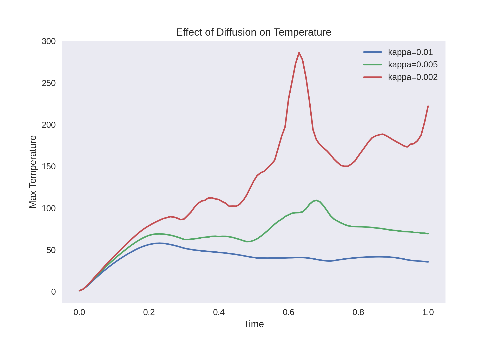
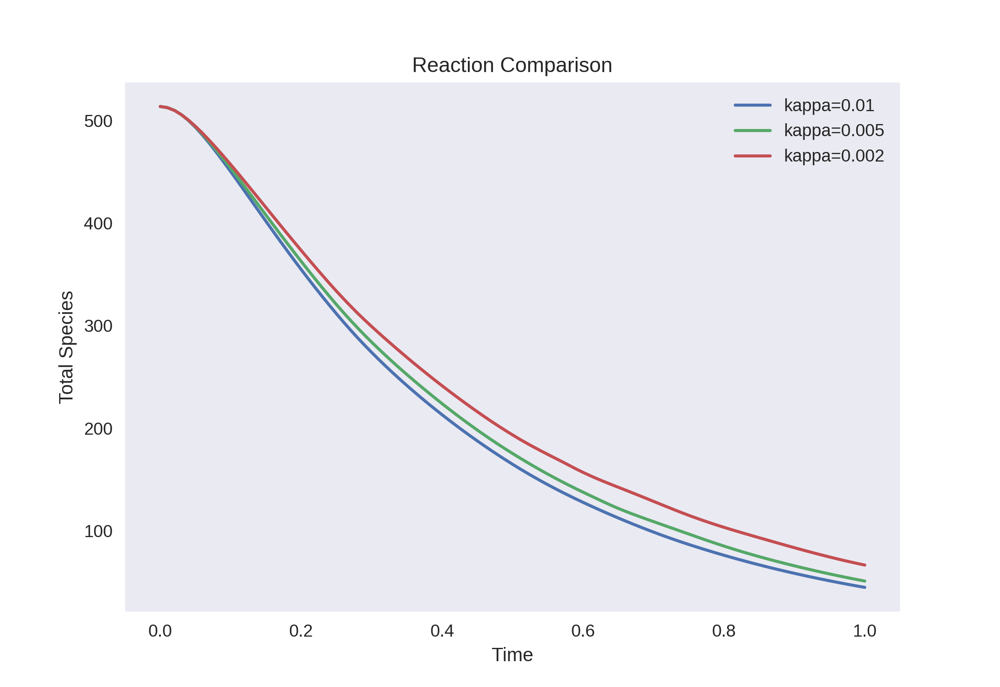
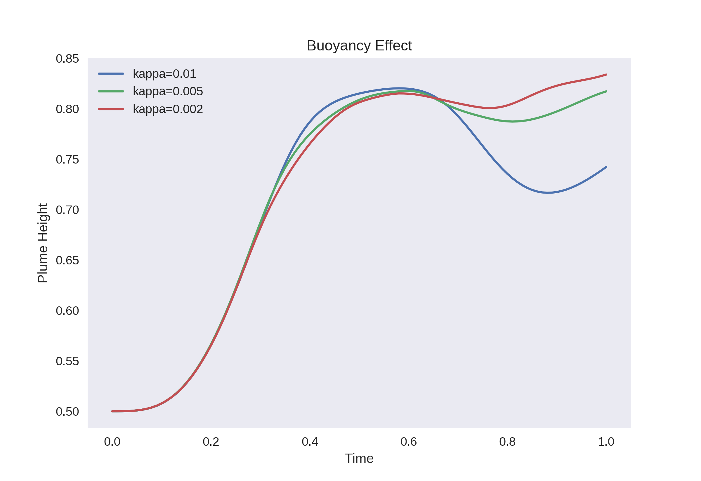
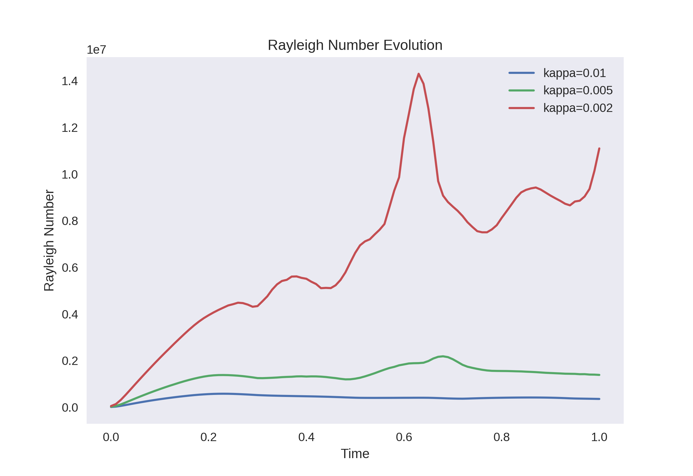
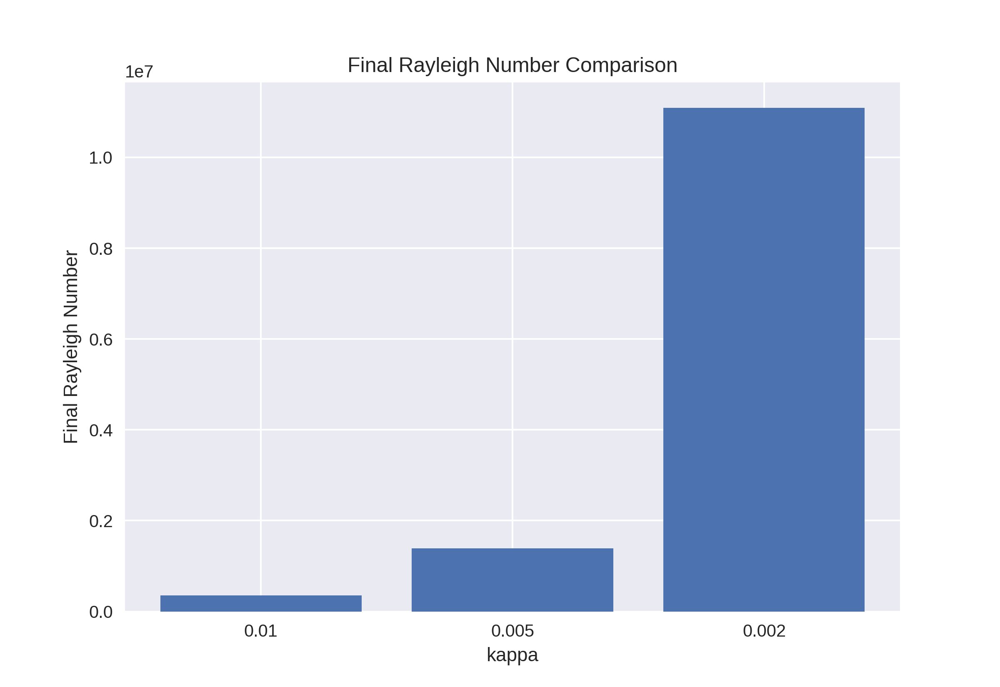

# Results and Discussion

## Introduction

This section presents the results obtained from the simulation and explains the physical behavior observed.

The study focuses on the effect of thermal diffusivity (kappa) on:

- Flow Visulaization
- Temperature evolution
- Species consumption
- Plume formation
- Buoyancy strength

--------------------------------------------------
## 2. Flow Visulaization

<h3>Species Evolution (C)</h3>
<video width="600" controls>
  <source src="../images/C.mp4" type="video/mp4">
  Your browser does not support the video tag.
</video>

<h3>Temperature Evolution (T)</h3>
<video width="600" controls>
  <source src="../images/T.mp4" type="video/mp4">
</video>

<h3>Vorticity Field</h3>
<video width="600" controls>
  <source src="../images/vort.mp4" type="video/mp4">
</video>

<h3>Velocity Magnitude</h3>
<video width="600" controls>
  <source src="../images/vel.mp4" type="video/mp4">
</video>

--------------------------------------------------

## 1. Temperature Evolution

### Observations

- Lower kappa results in higher temperature peaks
- Higher kappa leads to smoother and lower temperature values
- Temperature increases rapidly in the early stages due to reaction

### Explanation

- Reaction generates heat
- Low diffusivity means heat cannot spread quickly
- This causes heat to accumulate locally

Result:

- Strong temperature gradients
- Possibility of thermal runaway

--------------------------------------------------

## 2. Species Consumption

### Observations

- Species concentration decreases over time in all cases
- Faster consumption is observed for lower kappa
- Curves are smooth and stable

### Explanation

- Reaction rate depends on temperature
- Higher temperature leads to faster reaction
- Lower kappa leads to higher temperature

Result:

- Faster species depletion at low kappa
- Slower reaction at high kappa

--------------------------------------------------

## 3. Plume Height (Buoyancy Effect)

### Observations

- Plume rises faster for lower kappa
- Higher kappa results in weaker plume motion
- In some cases, plume rise slows down due to diffusion

### Explanation

- Temperature differences create buoyancy forces
- Low diffusivity maintains strong temperature gradients
- Strong gradients produce stronger upward force

Result:

- Strong convection at low kappa
- Weak convection at high kappa

--------------------------------------------------

## 4. Rayleigh Number Evolution

### Observations

- Rayleigh number increases rapidly for low kappa
- High kappa cases show slower growth
- Large separation between curves

### Explanation

- Rayleigh number measures buoyancy strength
- It increases with temperature
- It decreases with diffusivity

Result:

- Low kappa leads to strong convection
- High kappa leads to stable behavior

--------------------------------------------------

## 5. Final Rayleigh Number Comparison

### Observations

- kappa = 0.002 shows the highest Rayleigh number
- kappa = 0.01 shows the lowest Rayleigh number

### Explanation

- Lower diffusivity traps heat
- Trapped heat increases buoyancy
- Higher buoyancy leads to stronger flow

--------------------------------------------------

## 6. Overall Physical Behavior

The system shows a strong interaction between:

- Reaction
- Heat generation
- Fluid motion

### Key Process Chain

1. Reaction consumes species  
2. Heat is generated  
3. Temperature increases  
4. Buoyancy force develops  
5. Fluid rises and forms a plume  
6. Flow redistributes heat and species  

--------------------------------------------------

## 7. Effect of Thermal Diffusivity

Thermal diffusivity controls system behavior:

### Low kappa

- Heat is trapped
- Strong temperature gradients
- Fast reaction
- Strong buoyancy
- Unstable flow

### High kappa

- Heat spreads quickly
- Smooth temperature field
- Slower reaction
- Weak buoyancy
- Stable flow

--------------------------------------------------

## 8. Key Insights

- Diffusion stabilizes the system
- Reaction amplifies temperature
- Buoyancy drives flow
- Strong coupling leads to nonlinear behavior

--------------------------------------------------

## Final Understanding

This simulation demonstrates how:

- Small changes in diffusivity
- Can significantly affect system behavior

The system transitions from:

- Diffusion-dominated (stable)
to
- Convection-dominated (unstable)

--------------------------------------------------

## One-Line Summary

Lower thermal diffusivity leads to stronger temperature buildup, which increases buoyancy and results in more intense plume formation.
