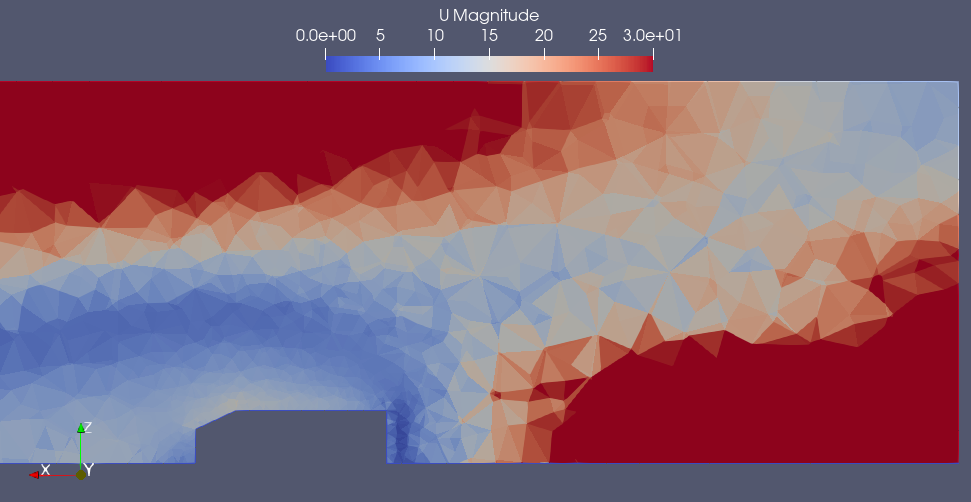

# Results & Analysis

## Drag Force

From the simulation (`forces.dat`):

- Pressure drag ≈ 23–24 N  
- Viscous drag ≈ 7–8 N  

Total drag force:

Fd ≈ 31 – 32 N

---

## Drag Coefficient Calculation

The drag coefficient is defined as:

Cd = Fd / (0.5 × rho × U² × A)

Where:

- rho = 1.225 kg/m³  
- U = 25 m/s  
- A = 0.112 m² (Ahmed body frontal area)

---

## Step-by-Step Calculation

Dynamic pressure:

q = 0.5 × rho × U²  
  = 0.5 × 1.225 × 25²  
  ≈ 382.8 N/m²  

---

Force normalization:

qA = 382.8 × 0.112  
   ≈ 42.9 N  

---

Drag coefficient:

Cd = 32 / 42.9  
   ≈ 0.75  

---

## Comparison with Literature

| Quantity | Expected Value | Obtained Value |
|----------|--------------|---------------|
| Drag Coefficient (Cd) | ~0.30 | ~0.75 |

---

## Observations

- The drag coefficient is significantly higher than expected  
- Flow field appeared stable after 5 seconds  
- Drag force oscillated around a mean value  

---

## Wake Structure

The flow separates at the rear of the Ahmed body, forming a low-velocity wake region.

This recirculation zone contributes significantly to pressure drag.

---

## Why is Cd High?

### 1. Coarse Mesh

- Total cells ≈ 40k tetrahedral cells  
- Insufficient wake resolution  
- Poor capture of separation  

---

### 2. Wake Not Properly Resolved

- Recirculation zone exaggerated  
- Base pressure too low  
- Leads to higher pressure drag  

---

### 3. Lack of Near-Wall Refinement

- Boundary layer not captured properly  
- Separation point inaccurate  

---

### 4. No Grid Independence Study

- Only one mesh used  
- Results not validated  

---

## Flow Nature

- Flow remains transient  
- Drag fluctuates over time  
- Mean value stabilizes  

→ This is a **statistically steady flow**, not a steady-state solution  

---

## Key Insight

- Solver setup is correct  
- Simulation is stable  
- Error mainly comes from mesh quality  

→ Physics is captured qualitatively, not quantitatively accurate yet
