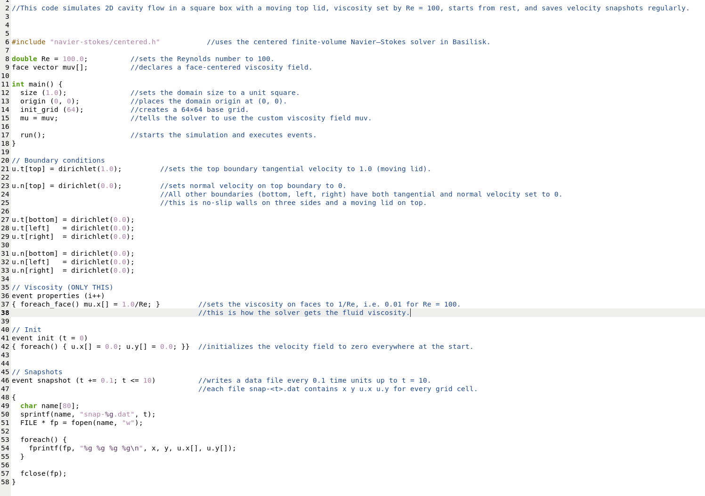
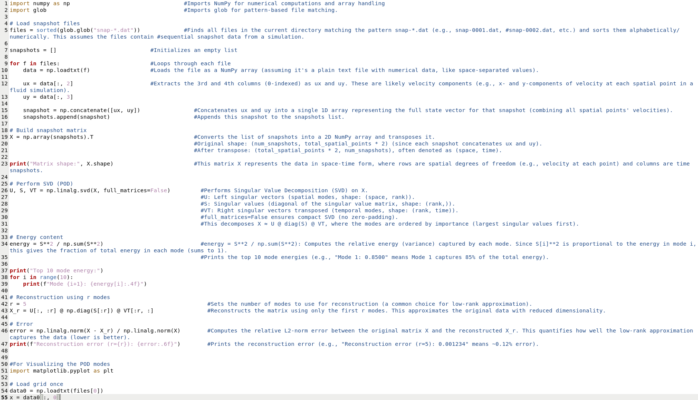
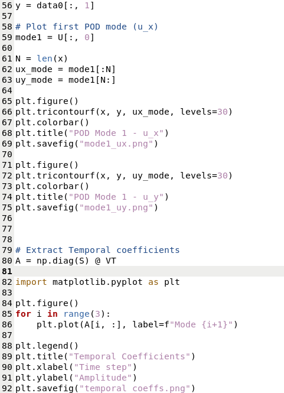

## Flowchart — cavity.c Logic

## Flow Logic — cavity.c

1. Initialize simulation domain and grid
2. Apply boundary conditions (moving lid + no-slip walls)
3. Initialize velocity field to zero
4. Start time-stepping loop:
   - Update viscosity field
   - Solve Navier–Stokes equations
   - Export snapshots at fixed time intervals
   - Advance time
5. Repeat until final time is reached
6. End simulation

---  
  
Simualtion Logic in Basilisk

---

Post processing using POD (Proper Orthogonal Decomposition)

